# job4j_tracker

## О проекте


Консольное приложение. Пользователю отображается меню с возможностями программы.
Программа может:
1. Добавлять заявку.
2. Заменять заявку на новую заявку по ID.
3. Удалять заявку по ID.
4. Отображать список всех заявок.
5. Производить поиск по имени заявки.

### Стек технологий
Java 17, JUnit 5, Liquibase 4.28.0, PostgreSQL 42, Hibernate 5.6.11.Final, H2 2.2.224, Mockito 5.2.0, Lombok 1.18.30, MapStruct 1.5.5.Final

### Требования к окружению
Java 17, Maven 3.4.0, PostgreSQL

### Запуск проекта

``` create database tracker;  ```
``` mvn clean install  `

### Взаимодействие с приложением

#### Скриншоты

##### *Старт*
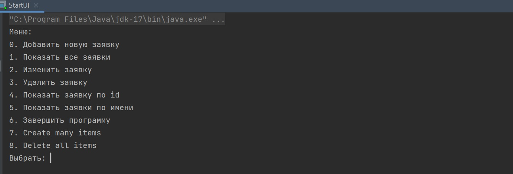

##### *Все заявки - заявок нет*
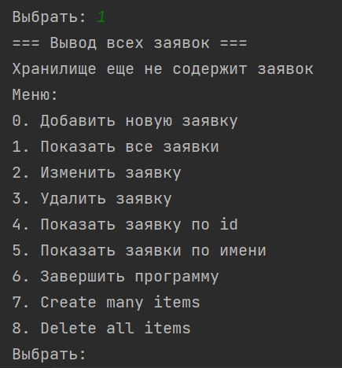

##### *Создать заявку*
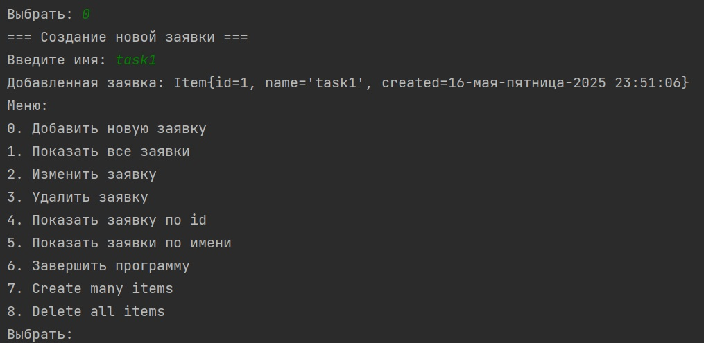

##### *Все заявки*
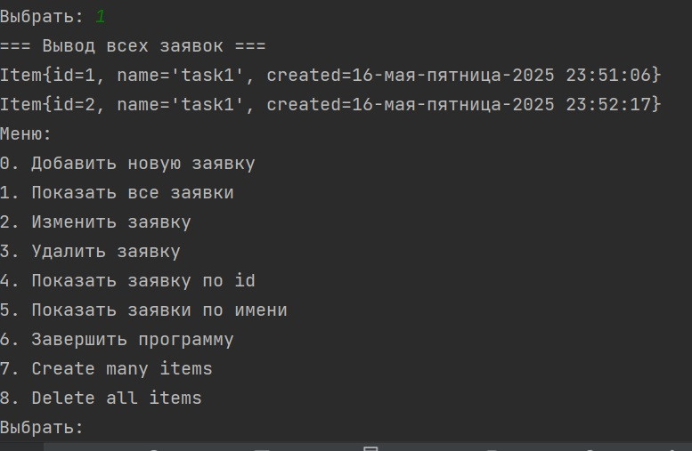

##### *Изменить заявку - ошибка*
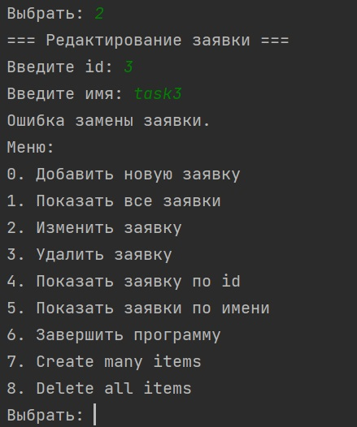

##### *Изменить заявку*
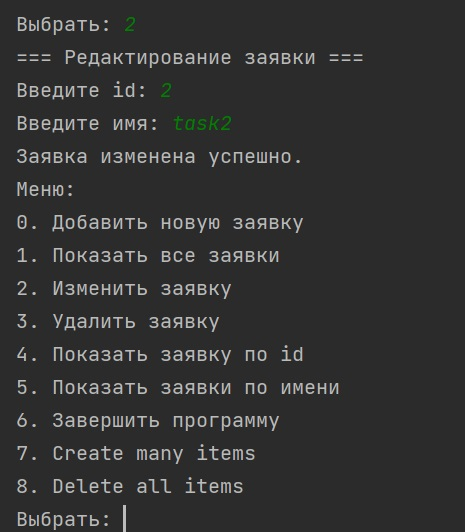

##### *Все заявки - после изменения*
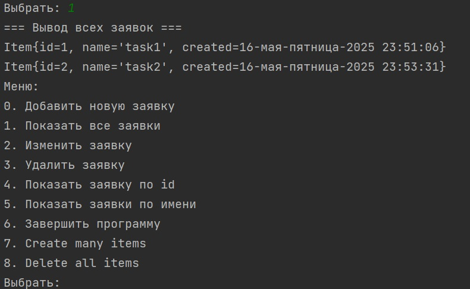

##### *Показать заявку по id - ошибка*
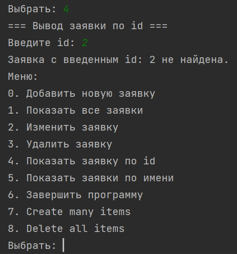

##### *Показать заявку по id*
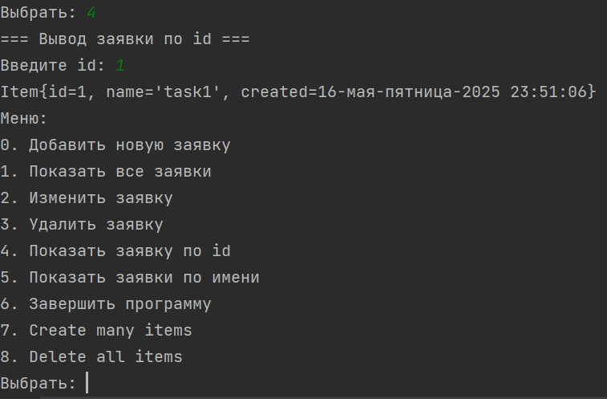

##### *Показать заявку по имени - ошибка*
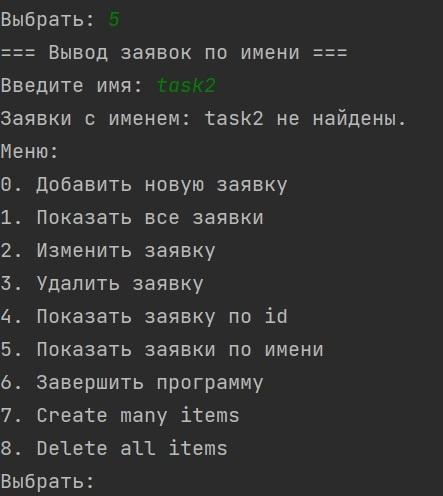

##### *Показать заявку по имени*
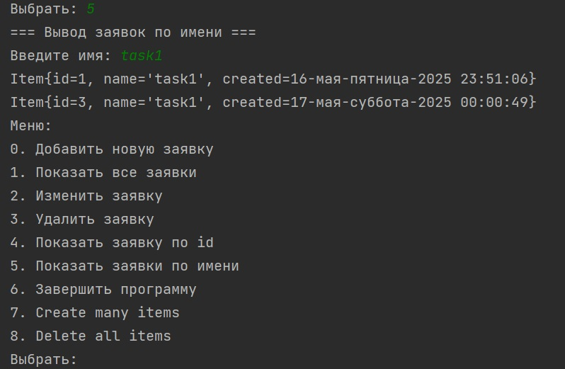

##### *Удалить заявку - ошибка*
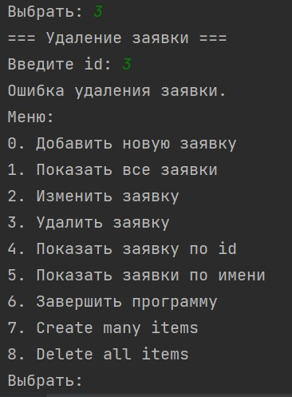

##### *Удалить заявку*
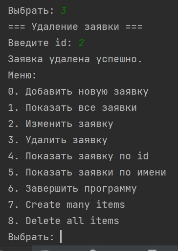

##### *Все заявки - после удаления*
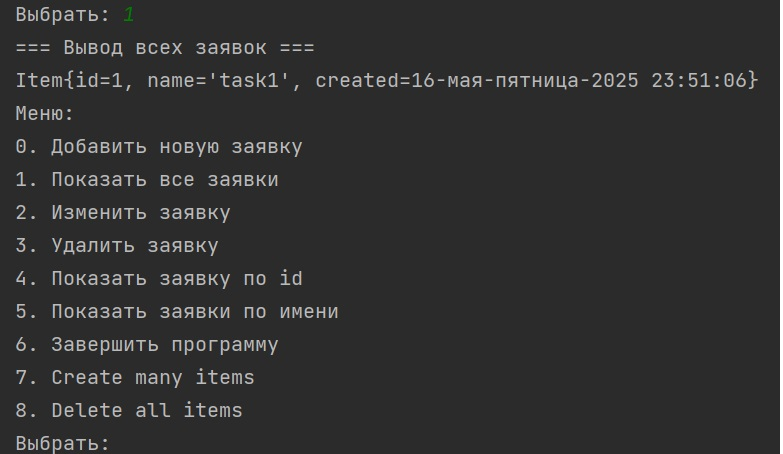

##### *Создать несколько заявок*
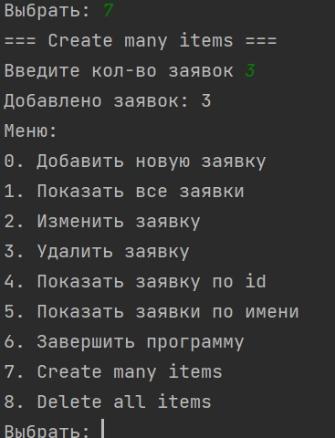

##### *Удалить все заявки*
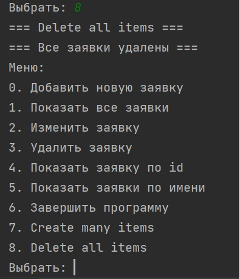

##### *Выход*
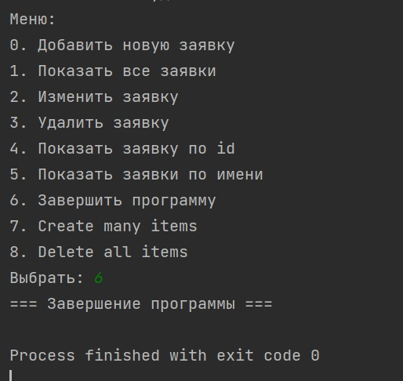

### Контакты


- Telegram: [@OlgaIlyina0312](https://t.me/OlgaIlyina0312)
- Email:    [oliljina@mail.ru](oliljina@mail.ru)